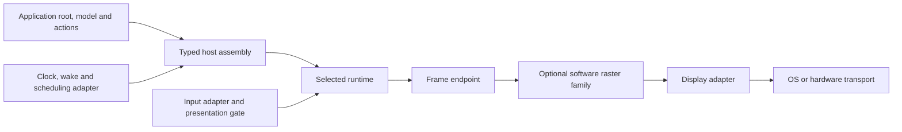

# EXP-002: Backend and Application Integration Shapes

Preparation for draft [ITERATION-003](../iterations/iteration-003-dev-ux-improvement.md).
The maintainer requested possible solutions and constraints without production
code changes. This is an active documentation exploration, not an approved
architecture, API, package topology, or implementation plan. All names and API
sketches below are illustrative and do not compile against current GiftUI.

## Questions / Hypotheses

1. What is the smallest application integration surface that removes repeated
   infrastructure while preserving application ownership of behavior and final
   component selection?
2. Can supported presets and custom composition share one typed assembly path
   without a platform-owned semantic stack or a runtime service registry?
3. At which boundary should a new display adapter, raster implementation, or
   complete rendering backend integrate? What is reusable at each boundary?
4. Which packaging/access changes are necessary independently of API syntax?
5. Which simplifications work with today's bounded Static mechanisms, and
   which depend on application lowering or generation that remains unproven?

## Scope

Compare application hosting, backend extension, build integration, and coarse
consumption units using the existing Pi Dynamic and nRF Static stacks. Include
desktop development as a proposed consumer proving ground. Draft interfaces
and evaluation scenarios only; no consumer, firmware, generator, package,
driver, or runtime implementation is introduced.

General configuration generation, complete static declaration replacement,
new hardware backends, automatic discovery, connected deployment/flashing,
multiple model/action domains, and independent release systems are excluded.
Generation is discussed as an alternative, not added to Iteration 3's scope.
Iteration 2 owns its approved cleanup and retained packed hierarchy; this
exploration does not reopen those choices.

## Known Constraints

The architecture feature and SPEC-013/014/015 are currently `implemented`.
Their evidence includes recorded exceptions; implemented status does not prove
every physical timing or input requirement. Iteration 3 remains draft revision
1. This work is post-MVP preparation, not a new ITERATION-001 requirement.

| Constraint | Consequence for a candidate | Authority / evidence |
| --- | --- | --- |
| One portable UI model, equivalent Static/Dynamic observable behavior | Storage and dispatch can differ; convenience cannot change identity, actions, layout, failures, or publication. | ADR-006; SPEC-013 |
| Explicit, separate integration ownership | A preset can assemble runtime, endpoint, input, scheduler and devices; the backend cannot become their semantic owner. | ADR-007; SPEC-014/015 |
| Portable Presentation imports `GiftUI` alone | Target selection stays at the host boundary. An assembly product cannot turn `GiftUI` into a renderer/platform umbrella. | ADR-008 |
| Current integration declarations are package SPI | Package extraction needs an intentional external contract; moving files or making every internal type public is insufficient. | SPEC-014/015; FW-016 |
| Synchronous one-shot Core frame handoff | Reserve before consuming; borrow operations/resources only during the offer; never replay within that offer or retain its stream for retry. A later opportunity may derive a fresh candidate under the approved retry policy. | ADR-010; SPEC-009/014 |
| Acceptance transfers responsibility | A later device fault is operational health, not a late Core abort. Async device work can use only bounded lower-owner data whose lifetime is guaranteed. | ADR-010; SPEC-014 |
| Input carries eligible physical-presentation provenance | Input is a sibling seam. A host preserves stale-event cancellation and cannot dispatch application actions from a display driver. | ADR-033; SPEC-011/015 |
| Capabilities, health, and diagnostics have different roles | The host resolves contributions once; an endpoint consumes the selected result. Diagnostics cannot decide correctness or recovery. | SPEC-003/004/014/015 |
| Static bounds and resource evidence | No required heap, reflection, runtime registry or arbitrary existential dispatch. Generics or presets still need assembled flash/RAM/stack/ABI evidence. | SPEC-013/014; EXP-001 |
| One immutable typed action domain and root observable-model location | A simpler application descriptor should parameterize these bindings, not silently introduce general nested model/action routing. | ADR-033; SPEC-010/011/015 |
| Exact text resources and workload bounds | A board preset cannot infer every application's glyphs, Canvas storage, semantic depth, event bursts or render limits. | SPEC-005/012/013/015 |
| Immutable selected configuration | Changing profile, surface, capabilities or graph means teardown and fresh construction, not live backend replacement. | SPEC-015 |

## Candidate Directions

### First separate the three users of integration

| User | What they supply | What they should be able to reuse |
| --- | --- | --- |
| Application author using supported hardware | Views, model, finite actions/handler, domain services, resource/workload inputs, chosen target and application policy | Host assembly, validated backend/display selection, runtime storage support, lifecycle, scheduling/input adapters and supported build entry point |
| Display/transport adapter author | Device initialization, geometry/encoding facts, bounded payload delivery, errors/health, ownership guarantees | Existing software raster family, endpoint/session logic and conformance fixtures; input/calibration is a separate adapter |
| Rendering backend author | An endpoint satisfying the frame contract and its resource/capability facts | Core handoff, validation/test vocabulary and optional raster/display helpers appropriate to the rendering family |

A new SPI display should not require a new semantic runtime. A renderer that
uses another graphics engine should not have to pretend to be an RGB565 tiled
rasterizer. Current approved contracts establish the raster family; a new
non-raster integration contract would need separate architectural review.

### Shape A — Explicit typed assembly

Provide an application-neutral assembly entry point. The application chooses
concrete runtime, presentation endpoint, input and environment adapters; the
assembly implementation owns the repetitive cross-owner joins. Concrete types
remain visible to the compiler and need not be represented by a universal
`any Backend` value.

```swift
// Candidate API sketch, not existing declarations.
var host = HostAssembly.make(
    application: CounterApplication.definition,
    runtime: StaticRuntime(storage: counterStorage),
    presentation: SoftwareRaster.tiledRGB565(
        display: SPIDisplay(transport: boardSPI, geometry: displayGeometry),
        resources: counterResources,
        storage: rasterStorage
    ),
    input: TouchInput(driver: boardTouch, calibration: calibration),
    environment: ZephyrEnvironment(clock: clock, wake: wake),
    budget: counterBudget,
    policy: applicationPolicy
)
```

`CounterApplication.definition` stands for a future typed root/model/action
binding and its supported declaration/storage adapter. It does not assert that
an arbitrary current observable class can compile unchanged on Embedded Swift.
`counterStorage` and `counterBudget` are finite application-specific inputs;
this sketch neither invents automatic sizing nor requires handwritten byte
offsets. The representation and producer of those inputs remain open.

**Benefits:** explicit dependencies, focused replacement seams, application
control, testable configurations and a plausible Static specialization route.

**Costs:** several concepts remain visible at initial setup. Too many generic
parameters can produce poor diagnostics or specialization costs. If the caller
still implements a complete pipeline-owner protocol, this would merely rename
the current wiring rather than remove it. Reusable assembly must absorb those
joins while borrowing application behavior at narrow typed boundaries.

**Best fit:** custom hosts, existing event loops and backend developers. Useful
as an advanced path, but probably too verbose as the only onboarding path.

### Shape B — Supported presets over typed assembly

Expose curated factories for a supported runtime/rendering/environment
combination. Each preset supplies coherent defaults and delegates to the same
assembly machinery as Shape A. The executable owns selection; a preset owns
no independent layout, action or state semantics.

```swift
// Candidate API sketch, not existing declarations.
var host = SupportedHost.zephyrStatic(
    application: CounterApplication.definition,
    board: NRF52840DK(spi: pins.spi, touch: pins.touch),
    display: SPITFT320x240(),
    resources: counterResources,
    storage: counterStorage,
    budget: counterBudget,
    policy: applicationPolicy
)
```

Board and display remain distinct inputs: a CPU board does not establish the
attached controller, panel orientation, touch calibration or wiring. A preset
could offer a known combination, but its name and validation should reveal
those assumptions. Supplying a custom conforming display should reuse the
assembly path rather than require copying the preset's internals.

Defaults can cover the known driver, raster encoding and standard lifecycle
policy. Application workload/resources and significant policy choices remain
explicit. A portable failure policy cannot be erased into `Bool` or a log
callback for convenience.

**Benefits:** smallest initial host file, discoverable supported configurations,
reproducible defaults and one maintained place for target-specific assembly.

**Costs:** presets need maintenance and can proliferate across combinations.
Opaque defaults hide constraints unless validation produces a readable report.
If custom composition is not supported, users fall off a cliff at the first
different display or scheduler. Static lowering remains a prerequisite; a
short factory call cannot solve that by itself.

**Best fit:** ordinary application onboarding. A strong candidate when paired
with Shape A as a documented customization path.

### Shape C — Build-generated assembly

A build description declares the application artifact, selected components
and finite budgets; tooling generates concrete host wiring, storage
declarations, dependency selection and shared Swift/C constants.

```text
Illustrative build description; no schema or file format is selected:

application = CounterApplication + supported static lowering inputs
profile = static
renderer = software raster / RGB565 tiles
environment = Zephyr / nRF52840-DK
display = specified controller + geometry + wiring
resources = CounterResources
budget = reviewed finite application and target limits
```

There are two different generation problems. **Assembly generation** selects
already available implementations and projects configuration. **Application
lowering** derives semantic/state/action/Canvas bindings and storage from UI
declarations. Solving the first does not solve the second. SPIKE-011's clean
analyzer topology emission does not establish a general compiler for arbitrary
applications.

**Benefits:** little repetitive source selection, consistent C/Swift values,
inspectable specialization and early configuration diagnostics.

**Costs:** another compiler/tooling surface, schema compatibility, stale-output
checks and reproducibility requirements. Cross-compilation, macro execution,
application discovery and full bounds derivation remain uncertain. Generated
host source can still be hard to understand if provenance is lost.

**Best fit:** a later automation layer if repeated supported-target setup shows
that typed factories and reusable build support leave material duplication.
General configuration generation remains excluded from draft Iteration 3;
adopting it would need an explicit scope and lifecycle decision. It is not a
prerequisite for discussing Shapes A/B.

### Comparison

The entries below are hypotheses based on the current contracts, not measured
consumer results. B can layer on A; C can generate calls to the same A. They
are not necessarily mutually exclusive architectures.

| Dimension                   | A: typed assembly                                | B: supported presets                    | C: generated assembly                                  |
| --------------------------- | ------------------------------------------------ | --------------------------------------- | ------------------------------------------------------ |
| First application setup     | Moderate                                         | Low for an actual supported combination | Low after tooling is established                       |
| Custom display or scheduler | Direct replacement of a component                | Good if the typed path is accessible    | Depends on schema and extension model                  |
| Static viability            | Plausible; must prove compiler/resource behavior | Inherits A plus preset closure costs    | Plausible specialization; lowering/tooling unproven    |
| Traceability                | Concrete source/types                            | Requires inspectable defaults/report    | Requires generated source and input provenance         |
| Tooling investment          | External contracts, factories and build support  | Same foundation plus curated presets    | Generator, reproducibility and extension contracts     |
| Main risk                   | Exposing too many internals as integration API   | Hidden policy or a preset-only dead end | Moving handwritten complexity into a fragile generator |

A runtime plugin/service registry is a useful contrast but a poor default
candidate: it conflicts with the current Static constraints and immutable
selection model. Dynamic-only discovery would be a separate feature, not a
required portable integration mechanism.

### Shared ownership shape

This diagram shows responsibilities and data flow, not selected package names
or a complete compiler dependency graph.



The reusable assembly owner would validate configuration, construct exactly
one coherent owner graph, manage activation/quiescence/teardown, join model and
action generations, coordinate frame/input publication and preserve typed
failure routing. The application would retain views, business operations,
action meaning, its data lifecycle, component selection and explicit policy.
Board/display adapters retain device facts and calibration. Focused runtime,
layout, render and backend owners retain their existing semantics.

The candidate host lifecycle is validate, construct, activate, service, then
quiesce/teardown. Factory and activation results should preserve structured
configuration or owner failures rather than return only an optional host. A
diagnostic could name an incompatible display encoding or insufficient glyph
capacity together with its required and supplied bounds; exact error types
and reporting behavior remain to be specified.

Application scheduling remains an open two-mode question. An embedded
application may need to service GiftUI inside an existing RTOS loop, while a
standalone sample benefits from a managed runner. A candidate could offer a
small service interface plus a platform runner, both using the same host
lifecycle. Clock/wake injection and callback serialization remain explicit;
the convenience runner cannot own all application tasks or permit reentrant
mutation. Exact methods and outcome types need later contract work.

### Packaging is a separate axis

Two consumption topologies deserve comparison: several products within one
package, or focused packages within the current repository. Both can provide
Shapes A/B. Folder extraction alone does not produce a public integration path.

Possible coarse consumption units are:

- **Framework:** declarations, focused semantic owners and selected Static or
  Dynamic runtime products. Portable presentation still imports only `GiftUI`.
- **Rendering:** the software raster family, text raster realization support
  and reusable raster endpoint/session implementation.
- **Environment/display adapters:** Linux and Zephyr support selected
  independently; board drivers do not become portable framework dependencies.
- **Application:** reference/domain/data code, workload inputs and final hosts.

These are candidates, not one package per module. The assembly factory may be
an upper composition product; its package location is unresolved. External
dependencies should follow approved lower contracts, without runtime-to-raster
or lower-owner-to-host imports. Splitting a contract into a neutral package is
justified only by an actual cycle or independent consumption need.

Cross-package access needs an explicit narrow extension contract. Keep most
workspace codecs, identity storage, diagnostics adapters and pipeline-owner
internals private/package-scoped where feasible. Public or explicitly unstable
extension surfaces need review; an access annotation is not an ownership or
compatibility policy. Assembly should not require an app to acquire privileged
access to all framework modules. Cross-module specialization, metadata and
Embedded linkage costs require actual builds before selecting topology.

### What a core backend foundation could contain

Existing surface, display, raster and integration owners already provide much
of this foundation. An additional module is useful only if it removes a
specific dependency or repeated implementation.

Common extension-facing support could expose frame/transfer contracts,
reservation grammar, validation helpers and conformance fixtures. Software
raster support could provide full-surface and operation-major tiled sessions,
glyph/stroke coverage and payload emission. OS/display adapters could provide
device access and lower transport bindings. These are distinct responsibilities
even if distributed together.

Layout, semantic expansion, model/action dispatch, platform discovery and
global services do not belong in a universal backend base. The current
`RasterBackendStartupValidator` and endpoint/session machinery are reuse
candidates, not evidence that every rendering backend should import a raster
implementation. A combined distribution product may package multiple owners
without merging their authority.

## Evidence Plan

The next study could use a small external counter/status application with one
observable root, a finite action enum, disabled Button state and changing text.
Add a tiny Canvas variant to test drawing/resource bounds; retain Signal
Analyzer as the nontrivial compatibility check. A miniature app alone cannot
prove arbitrary UI lowering or replace existing conformance evidence.

Before coding a Spike, agree the exact candidate, static adaptation boundary,
consumer toolchains and acceptable resource deltas. The following is a proposed
evaluation sequence, not authorized implementation tasks:

1. Record current setup steps, repository internals touched, copied code and
   generated/manual inputs. Compare the same consumer behavior for every
   candidate, including the steps hidden behind its preset or generator.
2. Start with desktop Dynamic for dependency/API diagnostics, then an actual
   nRF Static cross-build and Pi Dynamic build for feasibility. Publish which
   parts of the small app are unchanged, lowered, generated or handwritten.
3. Replace the display with a recording conformer and replace scheduling with
   a deterministic environment. Verify neither substitution alters portable
   UI/action code or copies a complete host implementation.
4. Test missing resources, encoding mismatch, insufficient regions/workspace,
   invalid capacities and incomplete configuration. Expect focused diagnostics
   and no partially activated host; no silent allocation fallback.
5. Exercise startup, repeated service, stale input, model/action replacement,
   pre-acceptance refusal, post-acceptance device fault and complete teardown.
   Preserve one-shot calls, borrow lifetime, physical input gating, ordered
   failures and exact ownership; inspect configuration reports.
6. Compare dependency closures and application glue; for Static compare actual
   linked flash/RAM, ABI, forbidden symbols and storage/stack evidence. Agree
   budgets before declaring a candidate cheaper or acceptable. Async owned
   payloads need their own bounded lifetime/drain proof.
7. Stop with an explicit negative or partial result if required declarations
   cannot lower, access contracts leak internals, ownership is ambiguous or
   budgets fail. Physical input/cadence/high-water need separately authorized
   connected evidence; cross-builds do not establish them.

Suggested decision metrics are setup actions, user-maintained files, copied
infrastructure, exposed framework concepts, failure-diagnostic clarity, custom
adapter replacement effort, reproducibility and assembled resource cost. No
numerical success threshold or one-button guarantee is invented in this draft.

## Findings

### Observed current state

Repository inspection on 2026-10-04 used HEAD `a14b0797` plus the current
working tree. Parallel Iteration 2 edits were present; they were not modified
or treated as completed cleanup. Earlier October 2 descriptions of all host
work as implementing are historical: current metadata marks the MVP owners
implemented, with exceptions recorded in ITERATION-001.

- `Package.swift` exports the portable declaration product and selected
  application/platform products, but no complete application-neutral host
  product. Relevant runtime/display/backend contracts remain package-scoped.
- `HostPresetBootstrap` already separates validation from construction and
  audits the constructed graph, but its first-party names and adjoining
  workload/storage inputs are Signal Analyzer-specific.
- `OneShotRasterBackendEndpoint` already implements reusable reservation,
  stream consumption and disposition behavior. New integration work should
  investigate exposing/wrapping this reuse rather than duplicating it.
- `StaticSignalAnalyzerNRFDisplayTransport` and its SPI conformer are narrow
  synchronous adapters, but the surrounding writer has fixed 320x240 geometry
  and a 2,560-byte slot. Renaming it alone would not make it general support.
- Concrete Pi/nRF endpoints and firmware build selection still live with
  reference-host wiring. That is a distribution/assembly burden, not proof of
  an ownership violation in the approved backend mechanics.
- EXP-001/SPIKE-009 found the unmodified Domain closure rejected by Embedded
  existential restrictions before view derivation. SPIKE-010 proved a partial
  snapshot/counting prerequisite, not stable identity/state/publication
  replacement. SPIKE-011 supports clean generation for the known analyzer
  inputs; it does not supply general application specialization.

### Inferences and provisional recommendation

Compare **A as the reusable foundation and B as its ordinary application
surface** first. Their combination could remove repeated wiring without hiding
the meaningful choice of application, runtime, renderer and hardware. Maintain
inspectable defaults and an advanced typed customization path. This is a
research preference, not a selected design or evidence of feasibility.

Treat build support and external access as equally necessary deliverables;
better initializer syntax alone cannot make firmware integration easy. Defer
C as a default integration requirement until a consumer study identifies
remaining duplication and proves its application-lowering prerequisites.
Static consumption is the deciding feasibility boundary, rather than something
to retrofit after validating a desktop-only convenience API.

## Remaining Unknowns

- What exact typed application descriptor preserves original UI/model/action
  semantics on Static, and who produces its bounded specialization artifacts?
  Resolve through a narrowly scoped consumer/lowering study, using EXP-001's
  evidence rather than promising arbitrary declarations.
- Which current package SPI becomes external assembly or extension API, and
  what compatibility policy is appropriate? Inventory actual consumer needs.
- Where does reusable host assembly live without creating a dependency cycle,
  and how much generic specialization does it add? Compare concrete graphs
  and paired builds, not conceptual module names.
- Can an existing app event loop and a managed sample runner share one precise
  serialized lifecycle? Specify wake, shutdown and callback behavior.
- Which limits are derived, explicitly supplied or merely preset defaults?
  Static storage cannot rely on observed demo maxima for unrestricted states.
- Which errors remain component-local versus the finite host failure sum?
  Convenience must preserve origin, partial effects and post-handoff health.
- Which package/product units allow independent rendering/display consumption
  while keeping constrained builds free of unused desktop/macros/toolchains?
- What setup and resource thresholds would make Iteration 3's provisional
  IT-AC-001/002/003 observable and reviewable?

## Disposition

Continue the documentation exploration with maintainer feedback. FW-030 is
promoted to this Exploration because the maintainer explicitly requested
candidate solution drafting; FW-016 participates as packaging context and
remains captured. No Spike, external consumer build or hardware campaign was
performed, and no implementation is authorized by this artifact.

After selecting the problem/outcome and gathering sufficient feasibility
evidence, prepare a Proposal for post-MVP external integration and route the
smallest coherent architectural decision cluster through RFC/ADR/Specification
review. Public host contracts, cross-package access and any ADR-008 distribution
change need their normal gates. Iteration scope approval remains separate.

## Revisit Triggers

- Maintainer feedback selects a candidate, narrows application-lowering scope,
  or supplies setup/resource budgets for a bounded consumer study.
- Iteration 2 changes the audited build/source/generation baseline.
- A second real application exposes missing host contracts or copied glue.

## References

- [ITERATION-003](../iterations/iteration-003-dev-ux-improvement.md)
- [ITERATION-001](../iterations/iteration-001-mvp.md)
- [FW-030](../future-work/fw-030-application-integration-experience.md)
- [FW-016](../future-work/fw-016-post-mvp-package-distribution-topology.md)
- [FW-006](../future-work/fw-006-generated-target-configuration.md) and [FW-009](../future-work/fw-009-shared-delegated-service-foundation.md) — context only
- [ADR-006](../adrs/adr-006-shared-semantics-runtime-profiles.md), [ADR-007](../adrs/adr-007-integration-ownership-and-host-composition.md), [ADR-008](../adrs/adr-008-module-dependency-graph-and-package-topology.md)
- [ADR-010](../adrs/adr-010-synchronous-one-shot-frame-handoff.md), [ADR-033](../adrs/adr-033-bounded-application-actions-and-model-target-dispatch.md)
- [SPEC-013](../specs/spec-013-runtime-profiles.md), [SPEC-014](../specs/spec-014-backend-integration.md), [SPEC-015](../specs/spec-015-host-configuration.md)
- [Backend/host/platform review](../iterations/iteration-002-review/08-backend-host-platform.md)
- [EXP-001](exp-001-nrf-hierarchy-derivation.md), [SPIKE-009](../spikes/spike-009-nrf-hierarchy-role-bindings.md), [SPIKE-010](../spikes/spike-010-bounded-declaration-traversal.md), [SPIKE-011](../spikes/spike-011-clean-topology-generation.md)
- [Package manifest](../../Package.swift)
- [Host preset bootstrap](../../Sources/GiftUIHostConfiguration/HostPresetBootstrap.swift)
- [Raster endpoint](../../Sources/GiftUIBackendIntegration/OneShotRasterBackendEndpoint.swift)
- [Display contracts](../../Sources/GiftUIDisplayCore/DisplayContracts.swift)
- [nRF display adapter](../../Sources/SignalAnalyzerTargetHost/StaticSignalAnalyzerNRFDisplayTarget.swift)
- [nRF SPI transport](../../Sources/SignalAnalyzerTargetHost/StaticSignalAnalyzerNRFSPITFTTransport.swift)
- [Pi endpoint](../../Sources/SignalAnalyzerTargetHost/DynamicSignalAnalyzerPiEndpoint.swift)
- [Firmware composition](../../firmware/nrf52840/applications/signal-analyzer-static/CMakeLists.txt)
